# Audio Capture Architecture Refactoring Plan

## 📋 Executive Summary

This document outlines a comprehensive refactoring plan for Livcap's audio capture architecture to eliminate code duplication, improve maintainability, and create a unified system for Core Audio tap management.

**Current State**: Multiple overlapping components with ~70% duplicate functionality
**Target State**: Unified, maintainable architecture with single source of truth for audio capture

---

## 🔍 Current Architecture Analysis

### Components Overview

| Component | Lines | Purpose | Status |
|-----------|-------|---------|--------|
| `CATapDescription.swift` | ~187 | Core Audio tap description helper | 🔴 High duplication |
| `SystemAudioManager.swift` | ~1000+ | Production audio capture (Chrome-focused) | 🟡 Works but duplicated |
| `CoreAudioTapEngine.swift` | ~400+ | Generic audio capture engine | 🟢 Clean but underutilized |
| `AudioProcessSupplier.swift` | ~160 | Process discovery service | 🟢 Good, reusable |

### Identified Problems

#### 1. **Major Code Duplication** 🚨
- **Chrome Process Discovery**: 3 different implementations
  - `CATapDescription.findChromePIDs()` - Shell-based approach
  - `SystemAudioManager.findChromeHelperObjectIDs()` - Core Audio approach (most robust)
  - `AudioProcessSupplier.getProcessesByName()` - Generic matching

- **Core Audio Property Reading**: 2-3 implementations
  - `CoreAudioUtils.readProcessList()` - Complete implementation
  - `AudioProcessSupplier.getAllAudioProcesses()` - Duplicate logic
  - `CATapDescription.getProcessName()` - Partial implementation

#### 2. **Architectural Overlap** 🔄
SystemAudioManager vs CoreAudioTapEngine duplicate functionality:
- ✅ Both create Core Audio taps
- ✅ Both create aggregate devices
- ✅ Both handle I/O processing
- ✅ Both manage tap lifecycles
- ✅ Both convert audio formats
- ✅ Both accumulate buffers

#### 3. **Maintenance Burden** 🔧
- Bug fixes must be applied to multiple places
- Inconsistent behavior between components
- Testing complexity due to duplicate paths
- New features require multiple implementations

---

## 🎯 Proposed Solution: Unified Architecture

### Design Principles

1. **Single Source of Truth**: One implementation for audio capture
2. **Clear Separation of Concerns**: Engine handles audio, Manager handles UI state
3. **Reusable Components**: Leverage existing `AudioProcessSupplier` and `CoreAudioUtils`
4. **Backward Compatibility**: Minimize breaking changes to existing code

### Target Architecture

```mermaid
graph TD
    A[SystemAudioManager] --> B[CoreAudioTapEngine]
    B --> C[AudioProcessSupplier]
    B --> D[CoreAudioUtils]
    B --> E[Internal TapDescription]
    C --> D
    
    F[CaptionViewModel] --> A
    G[Examples] --> B
    
    style A fill:#e1f5fe
    style B fill:#c8e6c9
    style E fill:#fff3e0
    style H fill:#ffebee
    
    H[CATapDescription.swift] -.-> |DELETE| I[🗑️]
```



### Core Components After Refactoring

#### 1. **Enhanced CoreAudioTapEngine** (Single Audio Capture Implementation)
```swift
@available(macOS 14.4, *)
final class CoreAudioTapEngine {
    
    // PRIVATE: Embedded tap description (replaces CATapDescription.swift)
    private struct TapDescription {
        let uuid = UUID()
        let isPrivate = true
        let muteBehavior: ProcessTapMuteBehavior = .unmuted
        let processObjectIDs: [AudioObjectID]
        
        var coreAudioDictionary: CFDictionary {
            // Essential Core Audio bridge logic only
        }
    }
    
    // Enhanced Initialization Options
    init(forProcesses processIDs: [AudioObjectID])
    init(forProcessNames names: [String])      // Uses AudioProcessSupplier
    init(forChrome())                          // Uses robust Chrome discovery
    
    // Unified API
    func startCapture() async throws -> AsyncStream<AVAudioPCMBuffer>
    func stopCapture()
    func isCapturing() -> Bool
}
```

#### 2. **Simplified SystemAudioManager** (UI State Manager)
```swift
@available(macOS 14.4, *)
class SystemAudioManager: ObservableObject, SystemAudioProtocol {
    
    // UI State Only
    @Published private(set) var isCapturing = false
    @Published private(set) var errorMessage: String?
    @Published private(set) var systemAudioLevel: Float = 0.0
    @Published private(set) var permissionStatus: PermissionStatus = .unknown
    
    // Delegation to Engine
    private var tapEngine: CoreAudioTapEngine?
    
    func startCapture() async throws {
        tapEngine = CoreAudioTapEngine.forChrome()
        // All audio logic delegated to engine
    }
}
```

#### 3. **Deleted Components**
- ❌ `CATapDescription.swift` - Functionality moved into `CoreAudioTapEngine`
- ❌ Duplicate Chrome discovery methods
- ❌ Duplicate Core Audio property reading

---

## 📋 Implementation Plan

### Phase 1: Prepare CoreAudioTapEngine Enhancement
**Duration**: 2-3 hours
**Risk**: Low

#### Tasks:
1. **Add TapDescription as private nested struct**
   ```swift
   // Inside CoreAudioTapEngine.swift
   private struct TapDescription {
       // Move essential parts from CATapDescription
   }
   ```

2. **Add convenience initializers**
   ```swift
   convenience init(forChrome()) throws {
       // Move robust Chrome discovery from SystemAudioManager
   }
   
   convenience init(forProcessNames names: [String]) throws {
       // Use AudioProcessSupplier internally
   }
   ```

3. **Enhance error handling**
   - Move comprehensive error types from SystemAudioManager
   - Improve logging and debugging

#### Validation:
- All existing CoreAudioTapEngine tests pass
- Examples continue to work without changes

### Phase 2: Refactor SystemAudioManager
**Duration**: 3-4 hours
**Risk**: Medium

#### Tasks:
1. **Remove duplicate audio capture logic**
   - Delete `setupSystemAudioTap()`
   - Delete `setupAudioProcessing()`
   - Delete `cleanupAudioTap()`
   - Delete Chrome discovery methods

2. **Replace with CoreAudioTapEngine delegation**
   ```swift
   func startCapture() async throws {
       tapEngine = CoreAudioTapEngine.forChrome()
       let stream = try await tapEngine.startCapture()
       // Process stream for UI updates only
   }
   ```

3. **Keep UI state management**
   - Retain all `@Published` properties
   - Keep permission handling
   - Keep audio level monitoring

#### Validation:
- All existing SystemAudioManager functionality works
- UI state updates correctly
- No breaking changes to CaptionViewModel

### Phase 3: Cleanup and Delete CATapDescription
**Duration**: 1 hour
**Risk**: Low

#### Tasks:
1. **Update imports**
   - Remove `CATapDescription` imports where no longer needed
   - Update type aliases if necessary

2. **Delete CATapDescription.swift**
   - Ensure no remaining references
   - Update project file

3. **Final testing**
   - Full application testing
   - Verify all audio capture scenarios work

#### Validation:
- Application compiles without errors
- All audio capture functionality preserved
- No performance regressions

---

## 📊 Benefits Analysis

### Quantitative Benefits

| Metric | Before | After | Improvement |
|--------|--------|-------|-------------|
| Total Lines of Audio Code | ~1,750 | ~900 | 48% reduction |
| Chrome Discovery Implementations | 3 | 1 | 67% reduction |
| Core Audio Property Reading | 3 | 1 | 67% reduction |
| Files to Maintain | 4 | 3 | 25% reduction |
| Test Paths | Multiple | Single | Simplified |

### Qualitative Benefits

#### For Developers 👨‍💻
- **Reduced Cognitive Load**: Single audio capture implementation to understand
- **Easier Debugging**: One place to add logging, breakpoints, and fixes
- **Faster Development**: New features only need one implementation
- **Better Testing**: Single code path to test thoroughly

#### For Users 👥
- **More Reliable**: Fewer places for bugs to hide
- **Consistent Behavior**: Same audio processing across all use cases
- **Better Performance**: Optimized single implementation

#### For Maintenance 🔧
- **Single Source of Truth**: Audio bugs fixed in one place
- **Easier Refactoring**: Clear boundaries between components
- **Better Documentation**: One comprehensive implementation to document

---

## ⚠️ Risk Assessment

### Low Risk ✅
- **Phase 1**: Adding to existing working code
- **Phase 3**: Simple cleanup and deletion
- **Backward Compatibility**: Existing public APIs preserved

### Medium Risk ⚠️
- **Phase 2**: Major refactoring of SystemAudioManager
- **Integration Points**: Ensuring UI state management works correctly
- **Testing Coverage**: Need comprehensive testing of new delegation

### Mitigation Strategies

1. **Incremental Implementation**: Each phase is independent and reversible
2. **Comprehensive Testing**: Test each phase before proceeding
3. **Backup Strategy**: Git branching allows easy rollback
4. **Feature Flags**: Could implement gradual rollout if needed

---

## 🧪 Testing Strategy

### Unit Tests
- **CoreAudioTapEngine**: Test all initialization methods
- **TapDescription**: Test Core Audio dictionary generation
- **SystemAudioManager**: Test UI state management and delegation

### Integration Tests
- **Chrome Discovery**: Verify Chrome Helper detection works
- **Audio Processing**: Verify audio stream generation
- **Error Handling**: Test all error scenarios

### System Tests
- **Full Audio Capture**: End-to-end Chrome audio capture
- **UI Integration**: Verify CaptionViewModel integration
- **Performance**: Ensure no regressions in audio processing

---

## 📅 Timeline

| Phase | Duration | Dependencies | Deliverables |
|-------|----------|--------------|--------------|
| **Phase 1** | 2-3 hours | None | Enhanced CoreAudioTapEngine |
| **Phase 2** | 3-4 hours | Phase 1 complete | Refactored SystemAudioManager |
| **Phase 3** | 1 hour | Phase 2 tested | Cleanup and deletion |
| **Testing** | 2 hours | All phases | Full validation |
| **Total** | **8-10 hours** | | Complete refactoring |

---

## 🎯 Success Criteria

### Functional Requirements ✅
- [ ] All existing audio capture functionality preserved
- [ ] Chrome Helper discovery works reliably
- [ ] UI state management continues to work
- [ ] No breaking changes to public APIs
- [ ] Performance maintained or improved

### Code Quality Requirements ✅
- [ ] 40-50% reduction in audio-related code duplication
- [ ] Single source of truth for audio capture
- [ ] Clear separation of concerns
- [ ] Improved test coverage
- [ ] Better error handling and logging

### Maintenance Requirements ✅
- [ ] Simplified debugging workflow
- [ ] Single place to add new audio features
- [ ] Reduced cognitive load for new developers
- [ ] Better documentation structure

---

## 🔄 Rollback Plan

If issues arise during implementation:

1. **Phase 1 Rollback**: Simply revert CoreAudioTapEngine changes
2. **Phase 2 Rollback**: Restore SystemAudioManager from backup
3. **Phase 3 Rollback**: Restore CATapDescription.swift file

**Recovery Time**: < 30 minutes for any phase

---

## 📚 References

- [Apple Core Audio Documentation](https://developer.apple.com/documentation/coreaudio)
- [AudioCap Example Project](https://github.com/insidegui/AudioCap)
- [macOS 14.4+ Audio Tap APIs](https://developer.apple.com/documentation/coreaudio/audio_hardware_services)

---

## 👥 Stakeholders

- **Primary**: Audio capture functionality users
- **Secondary**: Developers maintaining audio code
- **Reviewers**: Architecture team, code reviewers

---

*Last Updated: [Current Date]*
*Document Version: 1.0*
*Status: Ready for Implementation* 