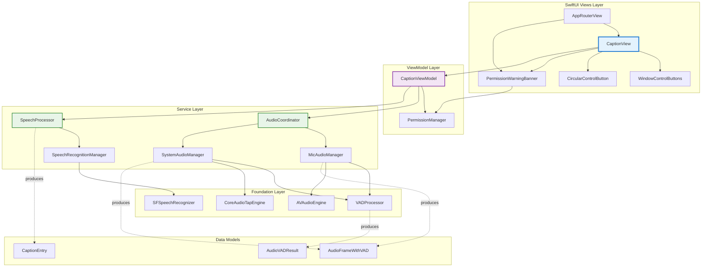
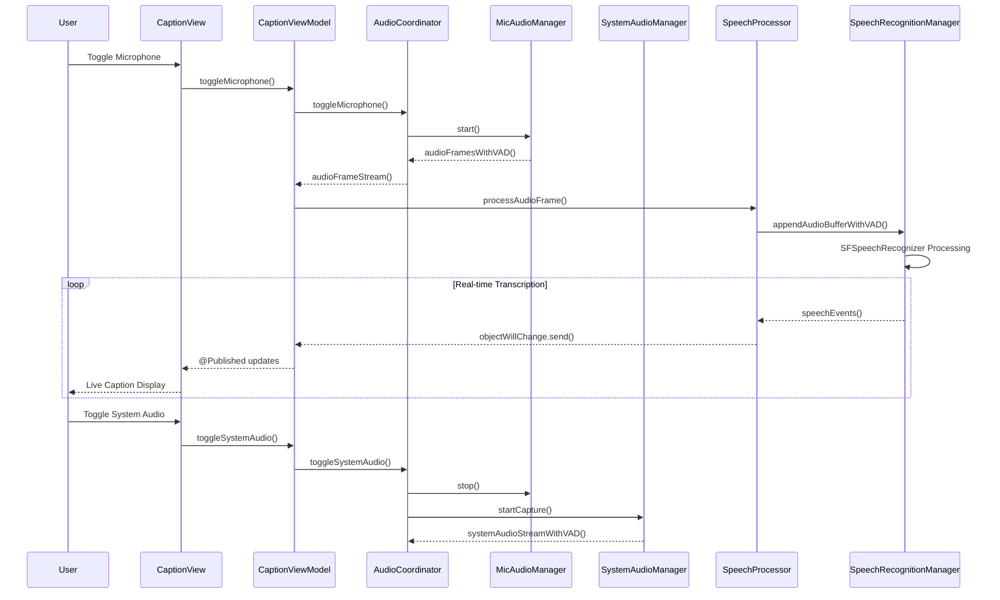
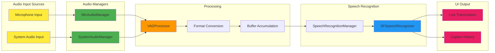
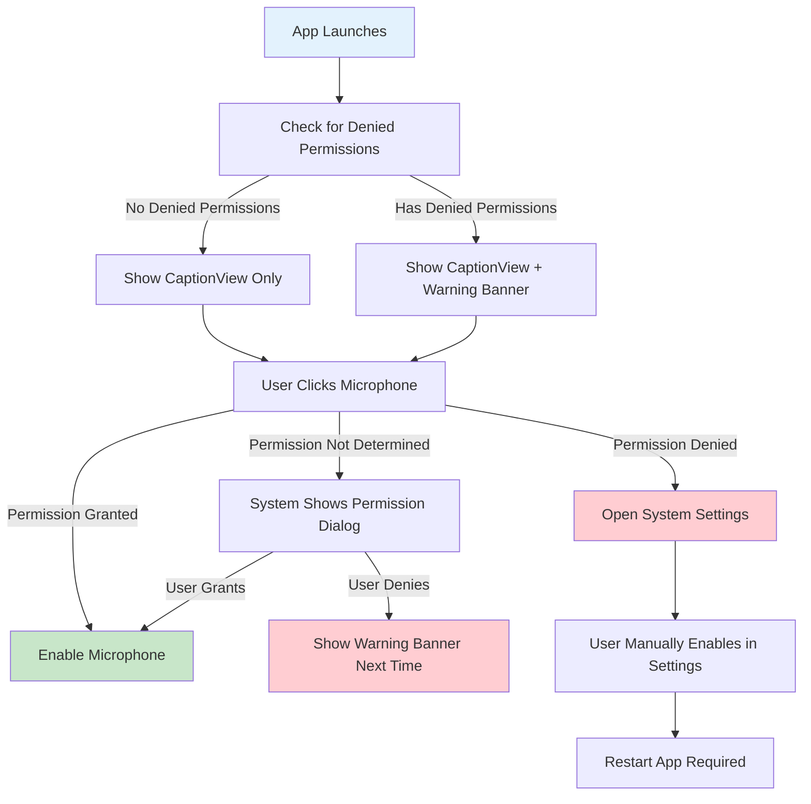

# Livcap SwiftUI Architecture Documentation
## Current Implementation: MVVM with Service Layer Architecture

Real-time live captioning application for macOS using SwiftUI, Core Audio, and SFSpeechRecognizer.

---

## 📋 Overview

Livcap implements a clean **MVVM (Model-View-ViewModel) with Service Layer** architecture, optimized for real-time audio processing and live speech recognition. The app provides seamless microphone and system audio capture with live transcription display.

### Core Architecture Principles

1. **MVVM Pattern**: Clear separation between UI (Views), business logic (ViewModels), and data (Models)
2. **Service Layer**: Focused, single-responsibility services for audio capture and speech processing
3. **Reactive UI**: SwiftUI with Combine for real-time data flow
4. **Async/Await**: Modern concurrency for audio processing pipelines
5. **Stream-based Architecture**: AsyncStream for audio data flow

---

## 🏗️ Architecture

### System Architecture Diagram



### Data Flow Architecture



### Audio Processing Pipeline



---

## 🔐 Permission System Architecture

### Simplified Non-Blocking Permission Flow

Livcap uses a **simplified 3-state permission approach** that prioritizes user experience and follows native macOS patterns:

#### Permission States
1. **✅ Granted** - Feature works normally
2. **❌ Denied** - Show warning banner with System Settings link
3. **❓ Not Determined** - Let system handle permission request automatically

#### Permission Flow Sequence


#### Key Principles
- **Never Block**: Always show main interface, never show blocking permission screens
- **System Native**: Let macOS handle permission request timing and UI
- **Denial Only**: Only intervene when permissions are explicitly denied
- **Clear Guidance**: Provide clear instructions for fixing denied permissions

---

## 📁 Component Details

### View Layer

#### `CaptionView.swift` - **Main Caption UI**
**Role**: Primary user interface providing adaptive layout and real-time caption display.

**Key Features**:
- **Adaptive Layout**: Automatically switches between compact (≤100pt height) and expanded layouts
- **Real-time Display**: Live transcription with auto-scroll to current content
- **Animation System**: First-content animation with smooth transitions
- **Control Integration**: Window controls, audio toggles, pin functionality

**Key Properties**:
```swift
struct CaptionView: View {
    @StateObject private var captionViewModel: CaptionViewModel
    @State private var isPinned = false
    @State private var isHovering = false
    @State private var showWindowControls = false
    
    // Animation state for first content appearance
    @State private var hasShownFirstContentAnimation = false
    @State private var firstContentAnimationOffset: CGFloat = 30
    @State private var firstContentAnimationOpacity: Double = 0
}
```

#### `WindowControlButtons.swift` - **Custom macOS Controls**
**Role**: Custom traffic light window controls with hover effects.

#### `CircularControlButton.swift` - **Reusable Control Component**
**Role**: Standardized button component with hover animations and material backgrounds.

#### `PermissionWarningBanner.swift` - **Non-blocking Permission Warning**
**Role**: Displays warning message when permissions are explicitly denied, with option to open System Settings.

**Key Features**:
- **Non-blocking Design**: Shows warning but doesn't prevent app usage
- **System Settings Integration**: Direct link to macOS Privacy Settings
- **Dismissible**: User can hide banner temporarily
- **Denied-only Display**: Only appears when permissions are explicitly denied (not for "not determined" state)

### ViewModel Layer

#### `CaptionViewModel.swift` - **Main Coordinator**
**Role**: Central coordinator managing audio sources and forwarding speech data to UI.

**Key Responsibilities**:
- Coordinate microphone and system audio (mutual exclusivity)
- Manage recording state lifecycle
- Forward caption data from services to UI
- Handle reactive state management
- Simple permission checking (only for denied permissions)

**Key Properties**:
```swift
final class CaptionViewModel: ObservableObject {
    @Published private(set) var isMicrophoneEnabled: Bool = false
    @Published private(set) var isSystemAudioEnabled: Bool = false
    @Published private(set) var isRecording = false
    @Published var statusText: String = "Ready to record"
    
    // Forwarded from services
    var captionHistory: [CaptionEntry] { speechProcessor.captionHistory }
    var currentTranscription: String { speechProcessor.currentTranscription }
}
```

#### `PermissionManager.swift` - **Simplified Permission Handler**
**Role**: Lightweight permission status checker focused only on denied permissions.

**Key Features**:
- **Simplified 3-State Model**: Only tracks denied, granted, not-determined
- **System-Native Requests**: Lets macOS handle permission dialogs automatically
- **Denial-Only Warnings**: Shows warning messages only for explicitly denied permissions
- **System Settings Integration**: Direct links to Privacy & Security settings

**Core Philosophy**:
```swift
// Only handle explicitly denied permissions - let system handle the rest
func isMicrophoneDenied() -> Bool {
    let status = AVCaptureDevice.authorizationStatus(for: .audio)
    return status == .denied || status == .restricted
}
```

### Service Layer

#### `AudioCoordinator.swift` - **Audio Source Manager**
**Role**: Central coordinator ensuring mutual exclusivity between audio sources.

**Key Features**:
- **Mutual Exclusivity**: Only one audio source active at a time
- **Unified Stream**: Single `audioFrameStream()` regardless of source
- **Automatic Switching**: Seamless transitions between microphone and system audio

#### `SpeechProcessor.swift` - **Speech Event Handler**
**Role**: Processes speech recognition events and forwards to UI layer.

#### `MicAudioManager.swift` - **Microphone Capture**
**Role**: Handles microphone audio capture with VAD processing.

**Key Features**:
- 16kHz mono audio capture optimized for speech recognition
- Real-time VAD (Voice Activity Detection)
- AsyncStream-based audio pipeline
- Automatic format conversion and buffer management

#### `SystemAudioManager.swift` - **System Audio Capture**
**Role**: System-wide audio capture using CoreAudioTapEngine (macOS 14.4+).

#### `SpeechRecognitionManager.swift` - **Speech Recognition Engine**
**Role**: Interfaces with SFSpeechRecognizer for real-time transcription.

### Foundation Layer

#### `VADProcessor.swift` - **Voice Activity Detection**
**Role**: Real-time voice activity detection using RMS energy analysis.

**Algorithm**:
```swift
private let energyThreshold: Float = 0.01
private let speechCountThreshold = 1
private let silenceCountThreshold = 2
```

---

## 🎨 Design System & Colors

### Color Scheme

#### Primary Background Colors
```swift
// Assets.xcassets/BackgroundColor.colorset/Contents.json
Light Mode: #EAEAEA (RGB: 234, 234, 234) - opacity: 1.0
Dark Mode:  #212121 (RGB: 33, 33, 33)   - opacity: 1.0

// Usage in code
extension Color {
    static let backgroundColor = Color("BackgroundColor")
}
```

#### System Adaptive Colors
- **Primary Text**: `.primary` (system adaptive black/white)
- **Secondary Text**: `.secondary` (system adaptive gray)
- **Control Active State**: `.primary`
- **Control Inactive State**: `.secondary`

#### Window Control Colors (Traffic Lights)
```swift
// Close Button
closeButton: Color.red.opacity(0.8)     // Default
closeButton: Color.red.opacity(1.0)     // Hover

// Minimize Button  
minimizeButton: Color.yellow.opacity(0.8)   // Default
minimizeButton: Color.yellow.opacity(1.0)   // Hover

// Maximize Button
maximizeButton: Color.green.opacity(0.8)    // Default
maximizeButton: Color.green.opacity(1.0)    // Hover
```

### Material & Visual Effects

#### Background Materials
```swift
// Main window background
.fill(Color.backgroundColor)
.background(.ultraThinMaterial, in: Rectangle())
.opacity(0.7)

// Button backgrounds
.fill(.ultraThinMaterial)
.opacity(isButtonHovering ? 1 : 0.5)
```

#### Corner Radius & Shadows
```swift
// Window corner radius
cornerRadius: 8 // Continuous style

// Button shadows
.shadow(color: .black.opacity(0.1), radius: 2, x: 0, y: 1)
```

---

## 🎬 Animation System

### 1. First Content Animation ✨

**The signature "first impression" animation when captions first appear**

#### Animation Parameters for Video Production
```swift
// === COPY THESE VALUES FOR VIDEO EDITING ===

// Movement Animation
startPosition: +30 pixels below natural position
endPosition: 0 pixels (natural position)
direction: Bottom to Up

// Opacity Animation  
startOpacity: 0% (completely transparent)
endOpacity: 100% (completely opaque)

// Timing
totalDuration: 0.6 seconds
animationType: Spring Animation
springResponse: 0.6 seconds
springDamping: 0.8 (0.8 = subtle bounce, 1.0 = no bounce)
blendDuration: 0.1 seconds

// Video Software Equivalent
easingCurve: "Ease Out Back" or "Spring" with slight bounce
alternativeEasing: "Ease Out Quart" (if spring unavailable)
```

#### Key Frame Timeline (0.6 seconds total)
```
Time: Position: Opacity:
0.0s  +30px    0%     (start below, invisible)
0.1s  +25px    15%    (moving up, fading in)
0.2s  +15px    40%    (accelerating up)
0.3s  +5px     70%    (approaching final position)
0.4s  -2px     90%    (slight overshoot - bounce effect)
0.5s  +1px     95%    (settle back down)
0.6s  0px      100%   (final position, fully visible)
```

#### Implementation Code
```swift
private func triggerFirstContentAnimation() {
    guard !hasShownFirstContentAnimation else { return }
    
    withAnimation(.spring(response: 0.6, dampingFraction: 0.8, blendDuration: 0.1)) {
        firstContentAnimationOffset = 0      // Move to natural position
        firstContentAnimationOpacity = 1.0   // Fade to full opacity
    }
    
    hasShownFirstContentAnimation = true
}
```

### 2. Auto-Scroll Animation

**Smooth scrolling to keep current transcription visible**

#### Parameters
```swift
duration: 0.3 seconds
easing: .easeOut
anchor: .bottom
trigger: onChange(of: captionViewModel.currentTranscription)
```

### 3. Control Button Animations

#### Hover Effects
```swift
// Control button hover
duration: 0.2 seconds
easing: .easeInOut
opacity: 0.5 → 1.0 (on hover)

// Control visibility
duration: 0.2 seconds  
easing: .easeInOut
opacity: 0.0 → 1.0 (on window hover)
scale: 0.8 → 1.0 (on appear)
```

#### Traffic Light Hover
```swift
duration: 0.2 seconds
easing: .easeInOut
opacity: 0.8 → 1.0 (on hover)
```

### 4. Window Management Animations

#### Window Control Appearance
```swift
duration: 0.2 seconds
easing: .easeInOut
opacity: 0.0 → 1.0
scale: 0.8 → 1.0
```

#### Window Maximize/Restore
```swift
duration: 0.3 seconds
easing: .easeInOut
```

---

## 📊 Performance Characteristics

### Audio Processing Performance

#### Microphone Capture
- **Sample Rate**: 16kHz (optimized for speech recognition)
- **Channels**: Mono (single channel)
- **Format**: Float32 PCM
- **Buffer Size**: Dynamic based on device (typically ~100ms)
- **Latency**: <50ms end-to-end

#### System Audio Capture (macOS 14.4+)
- **Sample Rate**: 16kHz (converted from source)
- **Channels**: Mono (stereo mixdown)
- **Format**: Float32 PCM
- **Processing**: Real-time via CoreAudioTapEngine
- **Target Processes**: All system audio processes

### Memory Management

#### Stream-Based Processing
- **Zero-Copy Operations**: Direct buffer processing where possible
- **SIMD Optimization**: vDSP for RMS calculations
- **Async Cleanup**: Proper task cancellation and resource cleanup
- **Weak References**: Prevent retain cycles in closures

#### UI Performance
- **LazyVStack**: Efficient scrollable caption history
- **Computed Properties**: Decomposed view components
- **Conditional Rendering**: Based on window state and content availability

---

## 🔧 Technical Implementation Details

### Mutual Audio Source Exclusivity

The `AudioCoordinator` ensures only one audio source is active at a time:

```swift
func toggleMicrophone() {
    if isMicrophoneEnabled {
        stopMicrophone()
    } else {
        if isSystemAudioEnabled {
            stopSystemAudio()  // Stop system audio first
        }
        startMicrophone()
    }
}
```

### Stream-Based Data Flow

Audio data flows through AsyncStreams for optimal performance:

```swift
// Unified audio stream regardless of source
func audioFrameStream() -> AsyncStream<AudioFrameWithVAD> {
    AsyncStream { continuation in
        while !Task.isCancelled {
            if self.isMicrophoneEnabled {
                // Process microphone stream
            } else if self.isSystemAudioEnabled {
                // Process system audio stream  
            }
        }
    }
}
```

### Voice Activity Detection

Real-time VAD using energy-based detection with state machine:

```swift
private let energyThreshold: Float = 0.01
private let speechCountThreshold = 1    // Frames to confirm speech
private let silenceCountThreshold = 2   // Frames to confirm silence

func processAudioBuffer(_ buffer: AVAudioPCMBuffer) -> AudioVADResult {
    var rms: Float = 0.0
    vDSP_rmsqv(channelData, 1, &rms, vDSP_Length(buffer.frameLength))
    
    // State machine logic for speech/silence detection
    // Returns: AudioVADResult(isSpeech: Bool, confidence: Float, rmsEnergy: Float)
}
```

---


## 📝 Conclusion

Livcap's current MVVM with Service Layer architecture successfully balances real-time performance requirements with maintainable SwiftUI patterns. The modular service layer enables easy testing and future enhancements, while the reactive UI ensures smooth user experience during live transcription sessions.

The **simplified permission system** follows native macOS patterns by letting the system handle permission requests automatically, only intervening when permissions are explicitly denied. This non-blocking approach ensures users can always access the main interface while receiving clear guidance for resolving permission issues.

The stream-based audio processing pipeline provides optimal performance for real-time applications, and the comprehensive animation system creates an engaging user experience with professional polish.

---

*This documentation reflects the current implementation and includes practical specifications for video production, design reference, and technical implementation details.* 