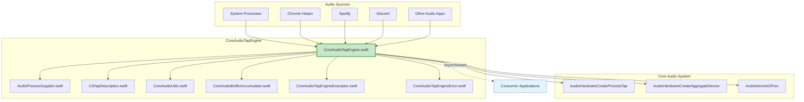
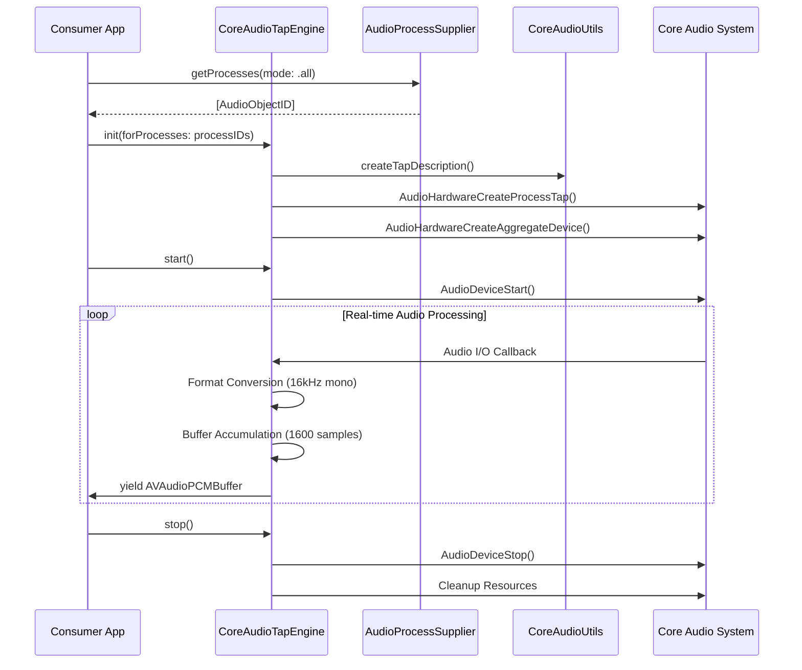

# CoreAudioTapEngine

A robust macOS 14.4+ Core Audio Tap engine for system-wide audio capture with real-time processing capabilities.

## 📋 Overview

CoreAudioTapEngine provides a clean, modern Swift interface for capturing system audio from multiple processes using Apple's Core Audio Tap technology. The engine handles all Core Audio complexity and delivers ready-to-use audio buffers optimized for real-time applications like live captioning.

## 🏗️ Architecture

### System Architecture Diagram



### Data Flow Architecture



## 📁 File Structure & Responsibilities

### Core Components

#### `CoreAudioTapEngine.swift` (400+ lines) - **Main Engine**
**Role**: Primary engine implementation providing the public API and coordinating all audio operations.

**Key Responsibilities**:
- **Public API**: `init()`, `start()`, `stop()`, `audioStream()`
- **Core Audio Integration**: Process tap creation, aggregate device management
- **Audio Processing**: Format conversion, buffer accumulation
- **Stream Management**: AsyncStream publication of audio buffers
- **Error Handling**: Comprehensive error management and recovery

**Key Classes**:
```swift
@available(macOS 14.4, *)
public class CoreAudioTapEngine {
    public init(forProcesses processIDs: [AudioObjectID]) throws
    public func start() async throws
    public func stop()
    public func audioStream() -> AsyncStream<AVAudioPCMBuffer>
}
```

#### `AudioProcessSupplier.swift` (275+ lines) - **Process Discovery**
**Role**: Discovers and manages audio-capable system processes for targeting.

**Key Responsibilities**:
- **Process Discovery**: Find all audio-capable system processes
- **Process Filtering**: Filter by name patterns, bundle IDs
- **Bundle ID Resolution**: Convert PIDs to Core Audio ObjectIDs
- **Selection Modes**: Support different targeting strategies

**Key Enums & Classes**:
```swift
public enum ProcessSelectionMode {
    case all
    case matching([String])
}

public class AudioProcessSupplier {
    public func getProcesses(mode: ProcessSelectionMode) throws -> [AudioObjectID]
}
```

#### `CATapDescription.swift` (38 lines) - **Tap Configuration**
**Role**: Minimal wrapper for Core Audio tap description creation.

**Key Responsibilities**:
- **Tap Description**: Create Core Audio-compatible tap descriptions
- **UUID Management**: Generate unique identifiers for taps
- **Configuration**: Set tap properties (private, mute behavior)

**Key Classes**:
```swift
@available(macOS 14.4, *)
class ProcessTapDescription: NSObject {
    init(stereoMixdownOfProcesses processObjectIDs: [AudioObjectID])
    var coreAudioDictionary: CFDictionary { get }
}

typealias CATapDescription = ProcessTapDescription
```

### Utility Components

#### `CoreAudioUtils.swift` (200+ lines) - **Core Audio Utilities**
**Role**: Shared utilities for Core Audio operations and extensions.

**Key Responsibilities**:
- **AudioObjectID Extensions**: Process list reading, PID resolution
- **Format Conversion**: Audio format utilities and conversions
- **Device Management**: Audio device discovery and configuration
- **RMS Calculation**: Audio level analysis utilities

**Key Extensions**:
```swift
extension AudioObjectID {
    func readPID() throws -> pid_t
    func readProcessList() throws -> [AudioObjectID]
    func readProcessBundleID() -> String?
}

// Audio format conversion utilities
func convertBufferFormat(_ buffer: AVAudioPCMBuffer, to format: AVAudioFormat) -> AVAudioPCMBuffer
```

#### `CoreAudioBufferAccumulator.swift` (150+ lines) - **Buffer Management**
**Role**: Efficient audio buffer accumulation and processing for optimal performance.

**Key Responsibilities**:
- **Buffer Accumulation**: Collect audio samples into target buffer sizes
- **Memory Management**: Efficient buffer allocation and reuse
- **Format Optimization**: Prepare buffers for downstream processing
- **Performance**: Minimize allocations and copying

**Key Classes**:
```swift
public class CoreAudioBufferAccumulator {
    public init(targetBufferSize: Int, format: AVAudioFormat)
    public func accumulate(_ samples: [Float]) -> [AVAudioPCMBuffer]
    public func flush() -> AVAudioPCMBuffer?
}
```

### Documentation & Examples

#### `CoreAudioTapEngineExamples.swift` (300+ lines) - **Usage Examples**
**Role**: Comprehensive examples demonstrating engine usage patterns.

**Key Examples**:
- **Basic Usage**: Simple system-wide audio capture
- **Process Filtering**: Target specific applications
- **Real-time Processing**: Live audio analysis examples
- **Error Handling**: Robust error management patterns

#### `CoreAudioTapEngineError.swift` (50+ lines) - **Error Management**
**Role**: Centralized error definitions for the entire engine.

**Key Error Types**:
```swift
public enum CoreAudioTapEngineError: Error {
    case unsupportedMacOSVersion
    case processNotFound(String)
    case tapCreationFailed(OSStatus)
    case aggregateCreationFailed(OSStatus)
    case invalidStreamDescription
    case formatCreationFailed
    case ioProcCreationFailed(OSStatus)
    case deviceStartFailed(OSStatus)
}
```

## 🔧 Key Features

### ✅ **System-Wide Audio Capture**
- Captures audio from all system processes simultaneously
- Supports selective process targeting
- Real-time audio stream processing

### ✅ **Optimized Audio Format**
- **Output Format**: 16kHz mono (optimal for speech recognition)
- **Buffer Size**: 1600 samples (100ms at 16kHz)
- **Format**: 32-bit float PCM, non-interleaved

### ✅ **Modern Swift Design**
- **Async/Await**: Full Swift concurrency support
- **AsyncStream**: Real-time audio streaming
- **Error Handling**: Comprehensive Swift error management
- **Memory Safe**: Automatic resource management

### ✅ **Performance Optimized**
- **Minimal Allocations**: Efficient buffer management
- **Real-time Safe**: Optimized for low-latency applications
- **Thread Safe**: Proper concurrency handling

## 💻 Usage Examples

### Basic System-Wide Capture

```swift
import CoreAudioTapEngine

@available(macOS 14.4, *)
class AudioCaptureService {
    private var engine: CoreAudioTapEngine?
    
    func startCapture() async throws {
        // Get all audio processes
        let supplier = AudioProcessSupplier()
        let allProcesses = try supplier.getProcesses(mode: .all)
        
        // Initialize engine
        engine = try CoreAudioTapEngine(forProcesses: allProcesses)
        
        // Start capture
        try await engine.start()
        
        // Process audio stream
        let audioStream = engine.audioStream()
        for await buffer in audioStream {
            // Process 16kHz mono audio buffer (1600 samples)
            processAudioBuffer(buffer)
        }
    }
    
    func stopCapture() {
        engine?.stop()
        engine = nil
    }
    
    private func processAudioBuffer(_ buffer: AVAudioPCMBuffer) {
        // Your audio processing here
        print("Received buffer: \(buffer.frameLength) frames")
    }
}
```

### Targeted Application Capture

```swift
@available(macOS 14.4, *)
func captureSpecificApps() async throws {
    let supplier = AudioProcessSupplier()
    
    // Target specific applications
    let chromeProcesses = try supplier.getProcesses(mode: .matching(["chrome"]))
    
    let engine = try CoreAudioTapEngine(forProcesses: chromeProcesses)
    try await engine.start()
    
    let audioStream = engine.audioStream()
    for await buffer in audioStream {
        // Process audio from Chrome only
        print("Chrome audio: \(buffer.frameLength) frames")
    }
}
```

### Real-time Audio Analysis

```swift
@available(macOS 14.4, *)
class AudioAnalyzer {
    private var engine: CoreAudioTapEngine?
    
    func startAnalysis() async throws {
        let supplier = AudioProcessSupplier()
        let allProcesses = try supplier.getProcesses(mode: .all)
        
        engine = try CoreAudioTapEngine(forProcesses: allProcesses)
        try await engine.start()
        
        let audioStream = engine.audioStream()
        for await buffer in audioStream {
            let audioLevel = calculateRMS(buffer)
            await updateAudioLevel(audioLevel)
        }
    }
    
    private func calculateRMS(_ buffer: AVAudioPCMBuffer) -> Float {
        guard let channelData = buffer.floatChannelData?[0] else { return 0.0 }
        let frameCount = Int(buffer.frameLength)
        
        var sum: Float = 0.0
        for i in 0..<frameCount {
            let sample = channelData[i]
            sum += sample * sample
        }
        
        return sqrt(sum / Float(frameCount))
    }
    
    @MainActor
    private func updateAudioLevel(_ level: Float) {
        // Update UI with audio level
        print("Audio level: \(level)")
    }
}
```

### Error Handling Best Practices

```swift
@available(macOS 14.4, *)
func robustAudioCapture() async {
    do {
        let supplier = AudioProcessSupplier()
        let processes = try supplier.getProcesses(mode: .all)
        
        guard !processes.isEmpty else {
            print("No audio processes found")
            return
        }
        
        let engine = try CoreAudioTapEngine(forProcesses: processes)
        try await engine.start()
        
        let audioStream = engine.audioStream()
        for await buffer in audioStream {
            // Process audio
        }
        
    } catch CoreAudioTapEngineError.unsupportedMacOSVersion {
        print("Requires macOS 14.4 or later")
    } catch CoreAudioTapEngineError.processNotFound(let processName) {
        print("Process not found: \(processName)")
    } catch CoreAudioTapEngineError.tapCreationFailed(let status) {
        print("Failed to create audio tap: \(status)")
    } catch {
        print("Unexpected error: \(error)")
    }
}
```

## ⚠️ Requirements & Limitations

### System Requirements
- **macOS 14.4+**: Core Audio Process Taps require Sonoma 14.4 or later
- **Audio Permissions**: Apps may require system audio permissions
- **Real-time Performance**: Designed for real-time audio processing

### Required Permissions Setup

Add the following key to your app's `Info.plist` to request system audio capture permissions:

```xml
<key>NSAudioCaptureUsageDescription</key>
<string>This app needs access to system audio to provide live captioning functionality.</string>
```

**Important**: Without this Info.plist entry, your app may not be able to access system audio or may crash when attempting to create audio taps.

### Known Limitations
- **macOS Only**: Core Audio Taps are macOS-specific
- **System Audio Only**: Cannot capture from audio input devices
- **Process Targeting**: Can only capture from running audio processes
- **Permission Dependent**: May require user permission for system audio access

## 🔍 Technical Details

### Audio Specifications
- **Sample Rate**: 16,000 Hz (16kHz)
- **Channels**: 1 (Mono)
- **Bit Depth**: 32-bit float
- **Buffer Size**: 1600 samples (100ms)
- **Format**: Non-interleaved PCM

### Performance Characteristics
- **Latency**: ~100ms (buffer size dependent)
- **CPU Usage**: Optimized for minimal overhead
- **Memory**: Efficient buffer management with minimal allocations
- **Thread Safety**: Full concurrency support

### Core Audio Integration
- **Process Taps**: Uses `AudioHardwareCreateProcessTap`
- **Aggregate Devices**: Creates virtual audio devices for capture
- **I/O Processing**: Real-time audio callbacks
- **Resource Management**: Automatic cleanup and resource deallocation

## 📚 Related Documentation

- [Apple Core Audio Documentation](https://developer.apple.com/documentation/coreaudio)
- [Audio Unit Programming Guide](https://developer.apple.com/library/archive/documentation/MusicAudio/Conceptual/AudioUnitProgrammingGuide/)
- [Core Audio Overview](https://developer.apple.com/library/archive/documentation/MusicAudio/Conceptual/CoreAudioOverview/)

## 🤝 Contributing

When contributing to CoreAudioTapEngine:

1. **Maintain Compatibility**: Ensure macOS 14.4+ compatibility
2. **Follow Architecture**: Respect the separation of concerns between files
3. **Add Tests**: Include comprehensive testing for new features
4. **Update Examples**: Add usage examples for new functionality
5. **Document Changes**: Update this README for architectural changes

## 📄 License

Part of the Livcap project. See project root for license information.

---

*CoreAudioTapEngine - Real-time system audio capture for macOS*  
*Optimized for live captioning and real-time audio analysis*  
*Requires macOS 14.4+ for Core Audio Process Tap support*