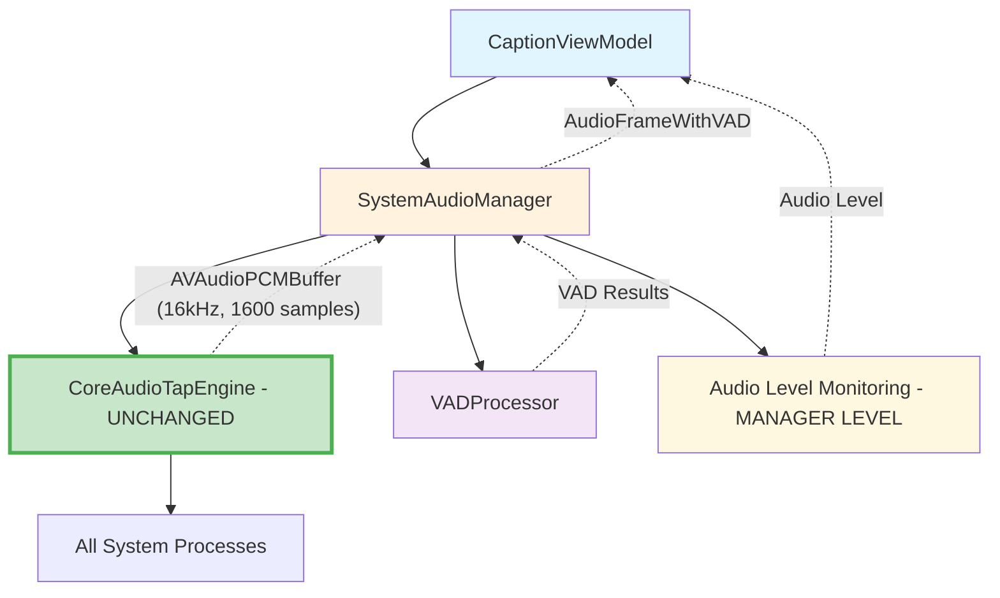
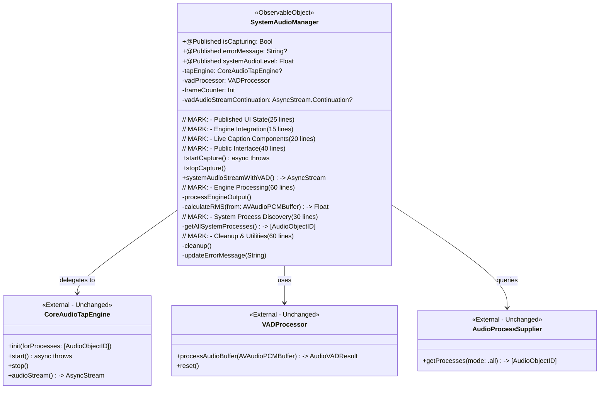
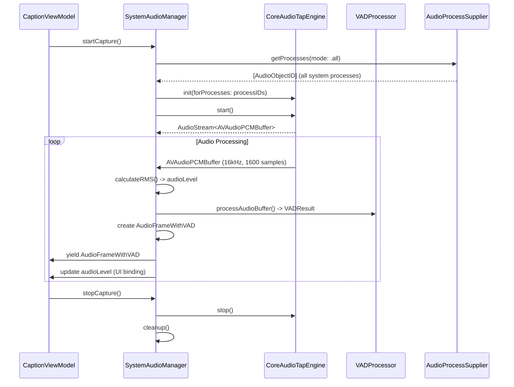

# SystemAudioManager Refactoring Plan (Updated)

## 📋 Executive Summary

This document outlines a comprehensive refactoring plan for `SystemAudioManager.swift` to leverage the existing `CoreAudioTapEngine` for **system-wide audio capture** while eliminating code duplication and improving maintainability.

**Key Principle**: SystemAudioManager should use CoreAudioTapEngine **AS-IS** for system-wide audio capture (all processes), not Chrome-specific targeting. **DO NOT modify CoreAudioTapEngine**. Any additional features like audio level monitoring or metadata should be implemented at the SystemAudioManager level.

**Current State**: SystemAudioManager (~1,414 lines) duplicates Core Audio logic that exists in CoreAudioTapEngine (~400 lines)  
**Target State**: SystemAudioManager as a lean facade (~300-400 lines) delegating audio capture to **unmodified** CoreAudioTapEngine

---

## 🔍 Current State Analysis

### SystemAudioManager.swift Capabilities (1,414 lines)

#### **Core Audio Processing** 🎵 (already handled by engine)
- ✅ Chrome Helper ObjectID discovery (`findChromeHelperObjectIDs()`) - **TO BE REMOVED**
- ✅ Core Audio tap creation and management - **REMOVE - ENGINE ALREADY HANDLES THIS**
- ✅ Aggregate device creation - **REMOVE - ENGINE ALREADY HANDLES THIS**
- ✅ Audio I/O processing with format conversion - **REMOVE - ENGINE ALREADY HANDLES THIS**
- ✅ Buffer accumulation (1024 samples for SFSpeechRecognizer) - **REMOVE - USE ENGINE DEFAULT (1600 samples)**
- ✅ Audio format conversion (48kHz→16kHz, stereo→mono) - **REMOVE - ENGINE ALREADY HANDLES THIS**

#### **Live Caption Integration** 🎯 (should stay in manager)
- ✅ VAD processing integration (`VADProcessor`)
- ✅ AudioFrameWithVAD stream output
- ✅ Real-time audio level monitoring - **KEEP IN MANAGER**
- ✅ Frame counter and metadata

#### **UI State Management** 🖥️ (should stay in manager)
- ✅ `@Published` properties for UI binding
- ✅ Error state management
- ✅ Capture state tracking

### CoreAudioTapEngine.swift Capabilities (400+ lines)

#### **Strengths** ✅
- ✅ Clean Core Audio tap implementation
- ✅ System-wide process-based initialization (perfect for our needs)
- ✅ Good error handling and logging
- ✅ Async/await design
- ✅ Works in isolation
- ✅ Outputs `AVAudioPCMBuffer` with engine's native format

#### **Current Design** ✅ **DO NOT MODIFY**
- ✅ System-wide audio capture (all processes)
- ✅ Engine's native audio format and buffer management
- ✅ Outputs `AVAudioPCMBuffer` - **Use as-is**

---

## 🎯 Refactoring Strategy

### Design Principles

1. **DO NOT Modify CoreAudioTapEngine**: Use engine exactly as-is
2. **System-Wide Audio Capture**: Use CoreAudioTapEngine for all system processes (not Chrome-specific)
3. **Use Engine Defaults**: Use engine's buffer size (1600 samples) and pre-converted audio format
4. **Manager-Level Features**: Audio level monitoring, VAD processing in SystemAudioManager
5. **Data Transfer Layer**: SystemAudioManager processes engine output for live caption pipeline
6. **API Compatibility**: Preserve existing SystemAudioManager public interface
7. **Single Source of Truth**: Eliminate duplicate Core Audio logic

### Target Architecture



---

## 🔧 Required SystemAudioManager Changes

### 1. **Remove Chrome-Specific Logic** 🗑️
```swift
// REMOVE ALL Chrome-specific code:
- findChromeHelperObjectIDs() 
- Chrome Helper discovery methods
- Chrome-specific process filtering
- All Chrome-related logging

// REMOVE all Core Audio duplication (engine already handles):
- Core Audio tap creation and management
- Aggregate device creation  
- Audio I/O processing
- Buffer accumulation (1024 samples) - Use engine's 1600 samples
- Audio format conversion - Engine already provides 16kHz mono
- Custom buffer size management - Use engine defaults
```

### 2. **Use System-Wide Process Discovery** ✅
```swift
// Replace Chrome targeting with system-wide capture
private func setupSystemAudioTap() async throws {
    // Use AudioProcessSupplier for all processes
    let allProcesses = try AudioProcessSupplier().getProcesses(mode: .all)
    guard !allProcesses.isEmpty else {
        throw CoreAudioTapEngineError.processNotFound("No audio processes found")
    }
    
    // Use CoreAudioTapEngine AS-IS
    tapEngine = try CoreAudioTapEngine(forProcesses: allProcesses)
    try await tapEngine.start()
}
```

### 3. **Manager-Level Audio Processing** 🎯
```swift
// Simplified audio processing in SystemAudioManager
class SystemAudioManager: ObservableObject {
    
    // KEEP these features in SystemAudioManager:
    @Published private(set) var systemAudioLevel: Float = 0.0
    private let vadProcessor = VADProcessor()
    private var frameCounter: Int = 0
    
    // NO format conversion - engine already provides 16kHz mono
    // NO buffer accumulation - use engine's 1600 sample buffers
    
    // Process engine output in manager
    private func processEngineOutput() {
        let audioStream = tapEngine.audioStream()  // Engine: 16kHz, 1600 samples
        for await buffer in audioStream {
            // Audio level monitoring - MANAGER LEVEL
            let rms = calculateRMS(from: buffer)
            await MainActor.run { self.systemAudioLevel = rms }
            
            // VAD processing - MANAGER LEVEL (use engine buffer directly)
            let vadResult = vadProcessor.processAudioBuffer(buffer)
            
            // Create enhanced frame - MANAGER LEVEL
            frameCounter += 1
            let audioFrame = AudioFrameWithVAD(
                buffer: buffer,  // Use engine buffer directly
                vadResult: vadResult,
                source: .systemAudio,
                frameIndex: frameCounter
            )
            
            vadAudioStreamContinuation?.yield(audioFrame)
        }
    }
}
```

---

## 🏗️ Refactored SystemAudioManager Architecture

### Core Responsibilities (Reduced to ~300-400 lines)

#### **1. Engine Integration** 🔄 (NO ENGINE CHANGES)
```swift
class SystemAudioManager: ObservableObject {
    
    // MARK: - Engine Integration (Use AS-IS)
    private var tapEngine: CoreAudioTapEngine?
    
    // MARK: - Manager-Level Features
    private let vadProcessor = VADProcessor()
    private var frameCounter: Int = 0
    @Published private(set) var systemAudioLevel: Float = 0.0
    
    // MARK: - System-Wide Engine Delegation
    func startCapture() async throws {
        // 1. Get all system processes (not Chrome-specific)
        let allProcesses = try AudioProcessSupplier().getProcesses(mode: .all)
        
        // 2. Initialize engine AS-IS
        tapEngine = try CoreAudioTapEngine(forProcesses: allProcesses)
        
        // 3. Start capture
        try await tapEngine.start()
        
        // 4. Process engine output at manager level
        processEngineOutput()
    }
}
```

#### **2. Manager-Level Audio Processing** 🎯
```swift
// MARK: - Simplified Audio Processing (Manager Level)
private func processEngineOutput() {
    // Get engine's audio stream (already 16kHz mono, 1600 samples)
    let audioStream = tapEngine.audioStream()
    
    for await buffer in audioStream {
        // Audio level monitoring - MANAGER LEVEL
        let rms = calculateRMS(from: buffer)
        Task { @MainActor in
            self.systemAudioLevel = rms
        }
        
        // VAD processing - MANAGER LEVEL (use engine buffer directly)
        frameCounter += 1
        let vadResult = vadProcessor.processAudioBuffer(buffer)
        
        // Create enhanced frame - MANAGER LEVEL
        let audioFrame = AudioFrameWithVAD(
            buffer: buffer,  // Use engine buffer directly (no conversion needed)
            vadResult: vadResult,
            source: .systemAudio,
            frameIndex: frameCounter
        )
        
        vadAudioStreamContinuation?.yield(audioFrame)
    }
}
```

#### **3. UI State Management** 🖥️ (Unchanged)
```swift
// MARK: - Published Properties (unchanged)
@Published private(set) var isCapturing = false
@Published private(set) var errorMessage: String?
@Published private(set) var systemAudioLevel: Float = 0.0
```

---

## 🏛️ Refactored SystemAudioManager Internal Architecture

### Overview
After refactoring, SystemAudioManager becomes a **lightweight coordination layer** (~250 lines) that bridges the CoreAudioTapEngine with live caption functionality. All Core Audio complexity is eliminated.

### Internal Structure Diagram



### Detailed Component Breakdown

#### **1. Published UI State (25 lines)**
```swift
// MARK: - Published Properties for UI Binding
@Published private(set) var isCapturing = false
@Published private(set) var errorMessage: String?
@Published private(set) var systemAudioLevel: Float = 0.0

// Simple state management - no complex audio state
private func updateUIState(capturing: Bool, level: Float = 0.0, error: String? = nil) {
    Task { @MainActor in
        self.isCapturing = capturing
        self.systemAudioLevel = level
        self.errorMessage = error
    }
}
```

#### **2. Engine Integration (15 lines)**
```swift
// MARK: - Engine Integration (Minimal)
private var tapEngine: CoreAudioTapEngine?

private func initializeEngine() async throws {
    let allProcesses = try AudioProcessSupplier().getProcesses(mode: .all)
    guard !allProcesses.isEmpty else {
        throw CoreAudioTapEngineError.processNotFound("No audio processes found")
    }
    
    tapEngine = try CoreAudioTapEngine(forProcesses: allProcesses)
    try await tapEngine.start()
}
```

#### **3. Live Caption Components (20 lines)**
```swift
// MARK: - Live Caption Processing
private let vadProcessor = VADProcessor()
private var frameCounter: Int = 0

// AsyncStream for VAD-enhanced audio
private var vadAudioStreamContinuation: AsyncStream<AudioFrameWithVAD>.Continuation?
private var vadAudioStream: AsyncStream<AudioFrameWithVAD>?

private func createVADFrame(from buffer: AVAudioPCMBuffer) -> AudioFrameWithVAD {
    frameCounter += 1
    let vadResult = vadProcessor.processAudioBuffer(buffer)
    
    return AudioFrameWithVAD(
        buffer: buffer,
        vadResult: vadResult,
        source: .systemAudio,
        frameIndex: frameCounter
    )
}
```

#### **4. Public Interface (40 lines)**
```swift
// MARK: - Public API (Unchanged from outside)
func startCapture() async throws {
    guard !isCapturing else { return }
    
    do {
        try await initializeEngine()
        processEngineOutput()
        updateUIState(capturing: true)
    } catch {
        updateUIState(capturing: false, error: error.localizedDescription)
        throw error
    }
}

func stopCapture() {
    tapEngine?.stop()
    cleanup()
    updateUIState(capturing: false)
}

func systemAudioStreamWithVAD() -> AsyncStream<AudioFrameWithVAD> {
    if let stream = vadAudioStream { return stream }
    
    let stream = AsyncStream<AudioFrameWithVAD> { continuation in
        self.vadAudioStreamContinuation = continuation
        continuation.onTermination = { @Sendable [weak self] _ in
            self?.stopCapture()
        }
    }
    
    self.vadAudioStream = stream
    return stream
}
```

#### **5. Engine Processing (60 lines)**
```swift
// MARK: - Engine Output Processing
private func processEngineOutput() {
    Task {
        guard let engine = tapEngine else { return }
        
        let audioStream = engine.audioStream()  // 16kHz mono, 1600 samples
        for await buffer in audioStream {
            // Audio level monitoring
            let rms = calculateRMS(from: buffer)
            await MainActor.run {
                self.systemAudioLevel = rms
            }
            
            // VAD processing
            let vadFrame = createVADFrame(from: buffer)
            vadAudioStreamContinuation?.yield(vadFrame)
        }
    }
}

private func calculateRMS(from buffer: AVAudioPCMBuffer) -> Float {
    guard let channelData = buffer.floatChannelData?[0] else { return 0.0 }
    let frameCount = Int(buffer.frameLength)
    
    var sum: Float = 0.0
    for i in 0..<frameCount {
        let sample = channelData[i]
        sum += sample * sample
    }
    
    return sqrt(sum / Float(frameCount))
}
```

#### **6. Cleanup & Utilities (60 lines)**
```swift
// MARK: - Cleanup and Utilities
private func cleanup() {
    vadAudioStreamContinuation?.finish()
    vadAudioStreamContinuation = nil
    vadAudioStream = nil
    vadProcessor.reset()
    frameCounter = 0
    tapEngine = nil
}

deinit {
    cleanup()
}
```

### Architecture Benefits

#### **Eliminated Complexity**
- ❌ **No Core Audio tap creation** (800+ lines removed)
- ❌ **No aggregate device management** 
- ❌ **No audio I/O callbacks**
- ❌ **No format conversion logic**
- ❌ **No buffer accumulation**
- ❌ **No Chrome-specific discovery**

#### **Retained Functionality**
- ✅ **VAD processing integration**
- ✅ **Real-time audio level monitoring**
- ✅ **UI state management**
- ✅ **AsyncStream output for live caption**
- ✅ **Error handling and recovery**

#### **Clear Responsibilities**
```
┌─────────────────────────────────────────────────────────────┐
│                 SystemAudioManager (~250 lines)            │
├─────────────────┬─────────────────┬─────────────────────────┤
│   UI State      │   Engine Bridge │   Live Caption          │
│   (25 lines)    │   (15 lines)    │   (20 lines)            │
│                 │                 │                         │
│ • isCapturing   │ • tapEngine     │ • vadProcessor          │
│ • audioLevel    │ • start/stop    │ • frameCounter          │
│ • errorMessage  │ • initialization│ • VAD stream            │
└─────────────────┴─────────────────┴─────────────────────────┘
                           │
                           ▼
┌─────────────────────────────────────────────────────────────┐
│             CoreAudioTapEngine (Unchanged)                  │
│                                                             │
│ • All Core Audio operations                                 │
│ • System-wide process capture                               │
│ • Audio format conversion (16kHz mono)                      │
│ • Buffer management (1600 samples)                          │
│ • Tap creation, aggregate devices, I/O processing           │
└─────────────────────────────────────────────────────────────┘
```

### Data Flow Architecture



---

## 📋 Implementation Plan

### Phase 1: Remove Chrome-Specific Logic (1-2 hours)
**Risk**: Low - Removing complex Chrome targeting

#### **Task 1.1: Remove Chrome-Specific Code** 🗑️
**Delete ~400 lines of Chrome-specific code:**
- `findChromeHelperObjectIDs()` - Remove entirely
- Chrome Helper discovery methods - Remove entirely  
- Chrome-specific process filtering - Remove entirely
- All Chrome-related logging and troubleshooting

#### **Task 1.2: Implement System-Wide Process Discovery**
```swift
// Replace Chrome targeting with system-wide
private func setupSystemAudioTap() async throws {
    let allProcesses = try AudioProcessSupplier().getProcesses(mode: .all)
    guard !allProcesses.isEmpty else {
        throw CoreAudioTapEngineError.processNotFound("No audio processes found")
    }
    // Continue with existing tap setup logic...
}
```

**Validation**: System-wide process discovery works, no Chrome dependencies

### Phase 2: Integrate CoreAudioTapEngine (2-3 hours)
**Risk**: Medium - Major refactoring to use engine

#### **Task 2.1: Replace All Core Audio Logic**
**Delete ~800 lines of duplicate Core Audio processing:**
- `setupSystemAudioTap()` - Replace with engine initialization
- `setupAudioProcessing()` - Replace with engine processing
- Core Audio tap creation and management - Use engine
- Aggregate device creation - Use engine  
- Audio I/O processing with callbacks - Use engine
- Buffer accumulation and format conversion - Use engine

#### **Task 2.2: Implement Engine Integration**
```swift
// Replace 800+ lines with ~30 lines
func startCapture() async throws {
    // Use system-wide process discovery
    let allProcesses = try AudioProcessSupplier().getProcesses(mode: .all)
    
    // Engine handles ALL Core Audio operations
    tapEngine = try CoreAudioTapEngine(forProcesses: allProcesses)
    try await tapEngine.start()
    
    // Process engine output at manager level (VAD + audio level only)
    processEngineOutput()
}
```

#### **Task 2.3: Simplified Manager-Level Audio Processing**
- Keep audio level monitoring in SystemAudioManager
- Remove format conversion - engine already provides 16kHz mono
- Keep VAD processing in SystemAudioManager
- Use engine's audio buffers directly (1600 samples at 16kHz)
- Remove buffer accumulation logic

**Validation**: Engine integration works, audio processing at manager level

### Phase 3: API Cleanup and Optimization (1-2 hours)
**Risk**: Low - Final cleanup

#### **Task 3.1: Remove Dead Code**
- Remove Chrome-specific helper methods
- Remove ALL Core Audio utilities (tap creation, aggregate device, I/O processing)
- Remove audio format conversion utilities
- Remove buffer accumulation logic
- Remove Core Audio callback implementations
- Clean up imports and dependencies

#### **Task 3.2: Update Documentation**
- Update class documentation to reflect system-wide capture
- Document engine integration pattern
- Remove Chrome-specific references

**Validation**: Clean codebase, system-wide functionality

---

## 📊 Expected Benefits

### Code Reduction 📉
| Component | Before | After | Reduction |
|-----------|--------|-------|--------------|
| SystemAudioManager | 1,414 lines | ~250 lines | 82% |
| Chrome-Specific Logic | ~400 lines | 0 lines | 100% |
| Core Audio Duplication | ~800 lines | 0 lines | 100% |
| Audio Processing Logic | ~400 lines | 0 lines | 100% |
| **Total Audio Codebase** | **~1,800 lines** | **~650 lines** | **64%** |

### Architecture Improvements 🔧
- **System-Wide Audio Capture**: Capture all system processes, not just Chrome
- **Engine AS-IS**: No modifications to working CoreAudioTapEngine
- **Use Engine Defaults**: Use engine's 16kHz, 1600-sample buffers directly
- **Manager-Level Features**: Audio level monitoring, VAD processing in manager
- **Single Source of Truth**: Core Audio logic centralized in engine
- **Better Performance**: No duplicate Core Audio processing, no format conversion

### Functional Improvements 🎯
- **Universal Compatibility**: Works with all audio applications, not just Chrome
- **Simplified Pipeline**: Engine (16kHz, 1600 samples) → SystemAudioManager (VAD) → Live Caption
- **Cleaner Separation**: Engine handles audio capture and format, Manager handles live caption features
- **Maintained Features**: Audio level monitoring, VAD processing preserved
- **Eliminated Redundancy**: No format conversion, no buffer accumulation

---

## ⚠️ Risk Assessment & Mitigation

### Medium Risks ⚠️

#### **Risk**: System-Wide Audio Capture Performance
- **Impact**: Capturing all processes might affect performance  
- **Mitigation**: CoreAudioTapEngine already handles this efficiently, test with real workloads
- **Rollback**: Add process filtering if needed

#### **Risk**: Audio Buffer Size Compatibility**
- **Impact**: Engine's 1600-sample buffers might not work with existing VAD processing
- **Mitigation**: Test VAD processor with 1600-sample buffers, engine format is already 16kHz mono
- **Rollback**: Add buffer size conversion if VAD requires different size

#### **Risk**: Engine Integration Breaking**
- **Impact**: Engine AS-IS might not integrate smoothly
- **Mitigation**: Use engine's existing public API, no modifications needed
- **Rollback**: Restore original Core Audio logic if integration fails

### Low Risks ✅

#### **Risk**: Chrome-Specific Logic Removal**
- **Impact**: Removing Chrome targeting for system-wide capture
- **Mitigation**: System-wide capture is more robust and universal
- **Rollback**: Re-add Chrome filtering if needed (unlikely)

---

## 🧪 Testing Strategy

### System-Wide Capture Tests
- **All Applications**: Test capture from various audio applications (not just Chrome)
- **Process Discovery**: Verify AudioProcessSupplier works with all system processes
- **Performance**: Test CPU and memory usage with system-wide capture

### Engine Integration Tests
- **AS-IS Usage**: Test CoreAudioTapEngine without modifications
- **Audio Stream**: Verify engine's audio stream works with manager processing
- **Error Handling**: Test engine error propagation to manager

### Manager-Level Feature Tests
- **Audio Level Monitoring**: Verify real-time level updates in manager
- **Buffer Size Compatibility**: Test VAD processing with 1600-sample buffers
- **VAD Integration**: Test VAD processing with engine's 16kHz mono output

### Regression Tests
- **Existing Functionality**: All current live caption features work
- **UI Integration**: CaptionViewModel integration unchanged
- **Performance**: No audio latency or quality degradation

---

## 📅 Timeline

| Phase | Duration | Dependencies | Key Deliverables |
|-------|----------|--------------|------------------|
| **Phase 1** | 1-2 hours | None | Removed Chrome-specific logic, system-wide process discovery |
| **Phase 2** | 2-3 hours | Phase 1 complete | CoreAudioTapEngine integration with manager-level processing |
| **Phase 3** | 1-2 hours | Phase 2 tested | Optimized and documented solution |
| **Testing** | 2-3 hours | All phases | Comprehensive validation |
| **Total** | **6-10 hours** | | Complete refactoring with system-wide audio capture |

---

## ✅ Success Criteria

### Functional Requirements
- [ ] System-wide audio capture (all processes, not Chrome-specific)
- [ ] CoreAudioTapEngine used AS-IS (no modifications)
- [ ] Audio level monitoring works in SystemAudioManager
- [ ] VAD processing works with engine output
- [ ] UI state management unchanged for consumers
- [ ] No breaking changes to CaptionViewModel API
- [ ] No Chrome-specific dependencies

### Performance Requirements  
- [ ] Audio latency maintained or improved
- [ ] Memory usage reduced (no duplicate Core Audio processing)
- [ ] CPU usage optimized (single Core Audio pipeline)
- [ ] System-wide capture performs efficiently

### Code Quality Requirements
- [ ] 80%+ reduction in SystemAudioManager size (1,414 → ~250 lines)
- [ ] Elimination of ALL Core Audio logic duplication
- [ ] Removal of all Chrome-specific code
- [ ] Removal of all Core Audio operations (tap, aggregate device, I/O processing)
- [ ] Clear separation between engine (all audio) and manager (VAD + UI only)
- [ ] CoreAudioTapEngine remains unchanged

---

## 🔄 Rollback Strategy

### Incremental Rollback Options
1. **Phase 1 Issues**: Restore Chrome-specific logic if system-wide fails
2. **Phase 2 Issues**: Restore original Core Audio logic if engine integration fails
3. **Performance Issues**: Add process filtering if system-wide is too heavy
4. **Feature Issues**: Keep existing audio processing if manager-level doesn't work

**Recovery Time**: < 1 hour for any phase rollback

---

## 🎯 Next Steps

1. **Review and Approve Updated Plan**: Stakeholder review of no-engine-modification strategy
2. **Create Feature Branch**: `feature/systemaudio-systemwide-noenginechange`
3. **Begin Phase 1**: Remove Chrome-specific logic, implement system-wide discovery
4. **Phase 2**: Integrate CoreAudioTapEngine AS-IS with manager-level processing
5. **Performance Validation**: Ensure system-wide capture performs well

---

## 🔍 Key Architectural Decisions

### ✅ **DO NOT Modify CoreAudioTapEngine**
- **Decision**: Use CoreAudioTapEngine exactly AS-IS
- **Rationale**: Engine works well, avoid breaking working code, simpler integration
- **Impact**: All additional features implemented at SystemAudioManager level

### ✅ **System-Wide vs Chrome-Specific**
- **Decision**: Use CoreAudioTapEngine for system-wide audio capture
- **Rationale**: More universal, simpler architecture, leverages engine's existing capabilities
- **Impact**: Removes 400+ lines of Chrome-specific code

### ✅ **Manager-Level Features**
- **Decision**: Implement audio level monitoring, VAD processing in SystemAudioManager
- **Rationale**: Keeps engine unchanged, maintains existing functionality, no format conversion needed
- **Impact**: Clean separation, engine for capture/format, manager for live caption features

### ✅ **Use Engine Defaults**
- **Decision**: Use engine's 16kHz mono format and 1600-sample buffers directly
- **Rationale**: Engine already provides optimal format for speech recognition, no conversion needed
- **Impact**: Eliminates format conversion code, simpler audio pipeline

### ✅ **System-Wide Process Discovery**
- **Decision**: Use AudioProcessSupplier for all system processes
- **Rationale**: Universal compatibility, eliminates Chrome targeting complexity
- **Impact**: Works with all audio applications, not just Chrome

---

*Last Updated: June 2025*  
*Document Version: 4.0*  
*Status: Ready for Implementation*  
*Focus: SystemAudioManager + CoreAudioTapEngine Integration (Engine AS-IS) for System-Wide Audio Capture*